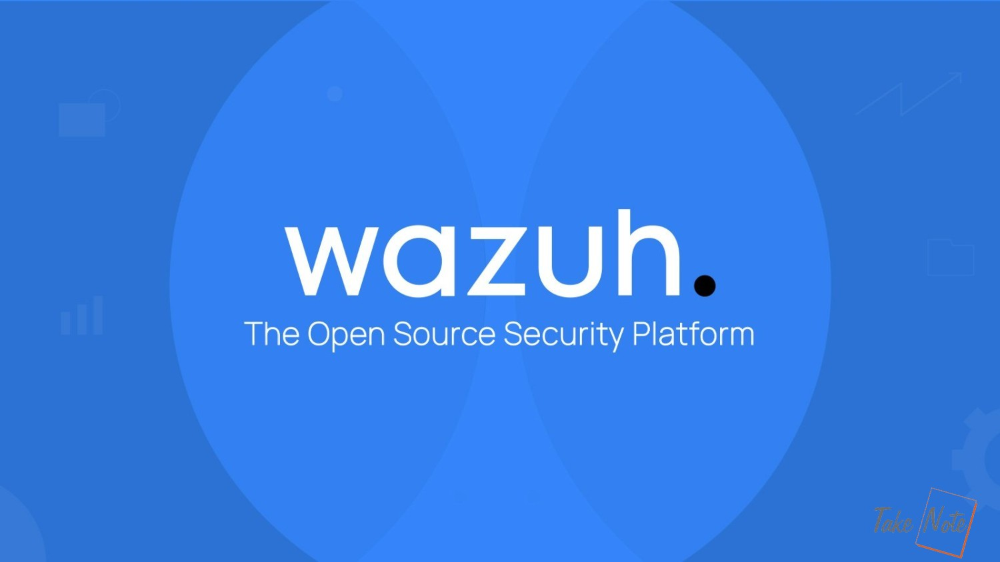

# Giải pháp SIEM && XDR với Wazuh

## Mô tả
Wazuh là một nền tảng giám sát bảo mật mã nguồn mở, cung cấp các tính năng như phát hiện mối đe dọa, giám sát tính toàn vẹn, phản ứng sự cố và quản lý tuân thủ. Nó thường được sử dụng để theo dõi các sự kiện bảo mật trong mạng, phát hiện xâm nhập và duy trì tính toàn vẹn của hệ thống bằng cách theo dõi liên tục các thay đổi trong cơ sở hạ tầng.
Wazuh có thể được triển khai trên nhiều hệ thống khác nhau, từ các máy chủ vật lý, máy ảo đến các nền tảng đám mây.                                          

## Module thực nghiệm: 
-	Cấu hình chặn địa chỉ IP độc hại truy cập đến Web Server
-	Giám sát tính toàn vẹn file(FIM) trên Wazuh
-	Phát hiện cuộc tấn công Brute-force trên Wazuh
-	Giám sát các sự kiên Docker
-	Phát hiện các tiến trình không được ủy quyền
-	Phát hiện các cuộc tấn công SQL Injection
-	Phát hiện các tệp nhị phân đáng ngờ trên Endpoint
-	Tích hợp VirusTotal và Wazuh để phát hiện và xóa các phần mềm độc hại
-	Tích hợp Yara và Wazuh để phát hiện phần mềm độc hại
-	Phát hiện lỗ hổng
-	Phát hiện tiến trình ẩn trên Ubuntu endpoint 
-	Giám sát việc thực thi các lệnh độc hại trên Wazuh
-	Phát hiện tấn công Shellshock

[Tài liệu tham khảo ở trang chính chủ Wazuh](https://documentation.wazuh.com/current/proof-of-concept-guide/index.html)
  
## Thiết Kế: Sơ đồ hệ thống mạng

## Chuẩn bị
-	[01 máy ảo hệ điều hành Windows Server 2012 hoặc 2019](https://www.microsoft.com/en-us/evalcenter/download-windows-server-2012-r2)
-	[02 máy ảo hệ điều hành Ubuntu Linux 20.04.6](https://releases.ubuntu.com/focal/) hoặc có thể [version cao hơn](https://ubuntu.com/download/server) : 1 máy làm Ubuntu Server phía Wazuh Agent, 1 máy Ubuntu chạy Wazuh Server *(thực hiện giám sát 2 máy Win Server và Ubuntu Server Agent)* 

